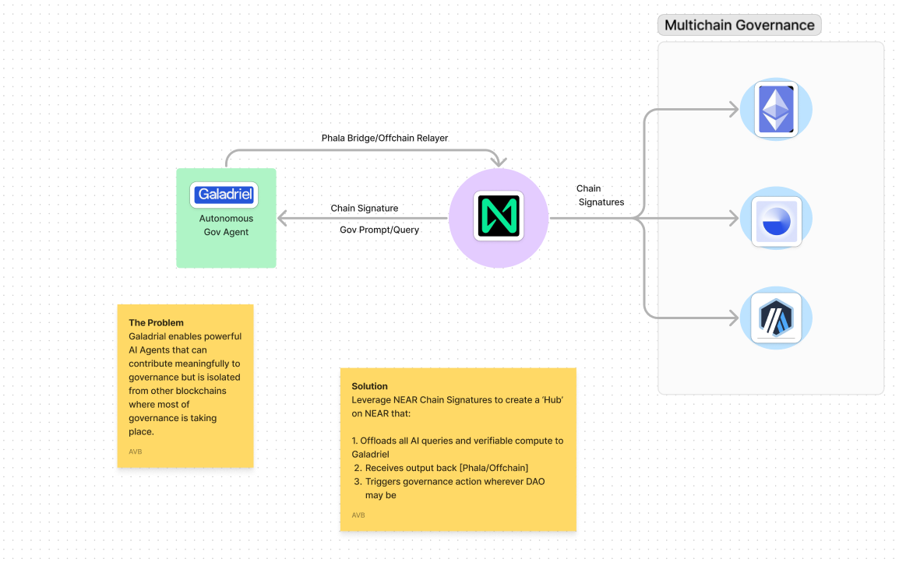
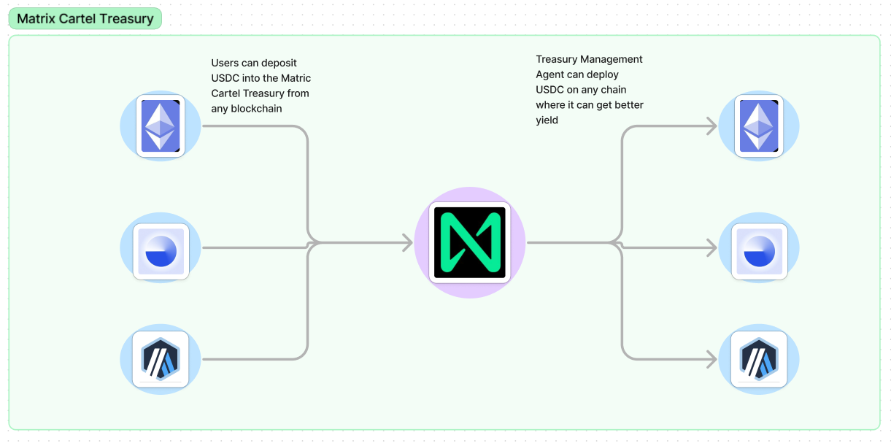
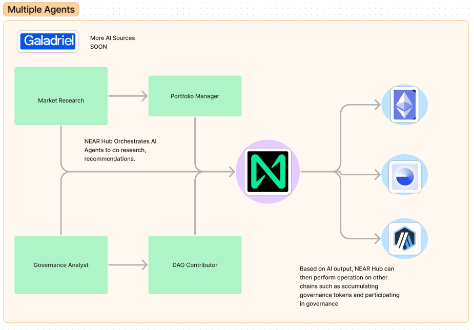

# Matrix Cartel
Matrix Cartel is a project using chain signatures to connect near and galadriel. This allow to give ownership of agents to accounts on near.
The goals are various, connecting in both ways near and galadriel would allow to give DAOs access to automatic intelligent systems, prompting numerous possibilities.
Beside the link between galadriel and near, the project aim to in the future, use near as a hub that would go get data outputs from galadriel or other L1 like this, send back the data to be processed by the central hub in near, and then prompting actions using chain signatures, on various other blockchains (bitcoin, ethereum, base, etc...).
## The goal

### The Matrix Cartel Vault. 
User are able to join the Matrix Cartel by depositing USDC into the Treasury. 
Treasury is on NEAR, but thanks to Chain Signatures users are able to deposit USDC on any EVM and they should be able to be a Matrix Cartel member even if they don't have a NEAR wallet.
### Matrix Cartel Agent Orchestration 

The NEAR Hub uses Chain Signatures to be able to connect to Galadriel as the AI Inference source. This is just the initial connection, and the Hub remains open to connecting to other networks and agents as the needs require. Some of the other networks can include Allora, Phala, Pond, etc. 
There are several agents engaging with each other with the objective of acquiring Tokens of projects that represent good value and then participate in governance. A playful analogy may be 'the hostile takeover of poorly managed human controlled DAOs by efficient AI agents' 
### The overview of the initial AI Agent Roles: 

1. Market Researcher: this agent is in charge of analysing potential projects for acquisition. Criteria can include: 
Current valuation and sources of revenue. Is the project currently undervalued and offering potential for passive income and or capital appreciation? 
Example: Meta Pool currently paying out 47% in staked NEAR per month. This would likely be picked up by Market Research as a good opportunity and be referred to Portfolio Manager 
2. Current State of Governance: is the DAO currently being mismanaged? Can the prospect of the project/token improve with AI agent intervention?
Example: X project with low valuation, bleeding money through non-sensical and opportunistic DAO requests, failing to properly promote a high quality product. Market research would highlight as take-over potential and Refer to Portfolio Manager
3. Portfolio Manager: based on the recommendations from Market Researcher, Portfolio Manager then goes out and starts accumulating the desired project's token and corresponding power of governance. It can also decide to start selling the token after certain targets are met or if the initial thesis proves to be incorrect. 
4. Treasury Manager: the role of this agent is to manage the unallocated USDC Treasury. Instead of sitting on idle stable coin funds, the Treasury Manager would search for low risk, high yield opportunities to grow treasury. 1. For example, it may deposit USDC into AAVE to earn 8%. (Common Theme, Chain Abstraction enables it to move assets across chains to where best yield is)
5. Governance Analyst: this agent is in charge of monitoring and assessing and governance proposals of project's of interest (AI inference on Galadriel). Issues recommendations to DAO Contributor Agent. 
6. DAO Contributor Agent acts of the recommendations from Governance Analyst and is the one that actually participates in governance discussions (outputs information) and can participate on DAO votes on any chain thanks to Chain Abstraction.

## How it's made
We didn't have time to implement a lot, we played around with the different tutorials present in this repo, of galadriel, near, and also a little bit of phala network. But nothing finished was possible for us to show currently. We did deploy to galadriel several contracts, and created signed transactions using near's chain signatures, but were too short on time to actually deploy using it.
## What's next
A lot of implementation now needs to be done, after polishing the idea.